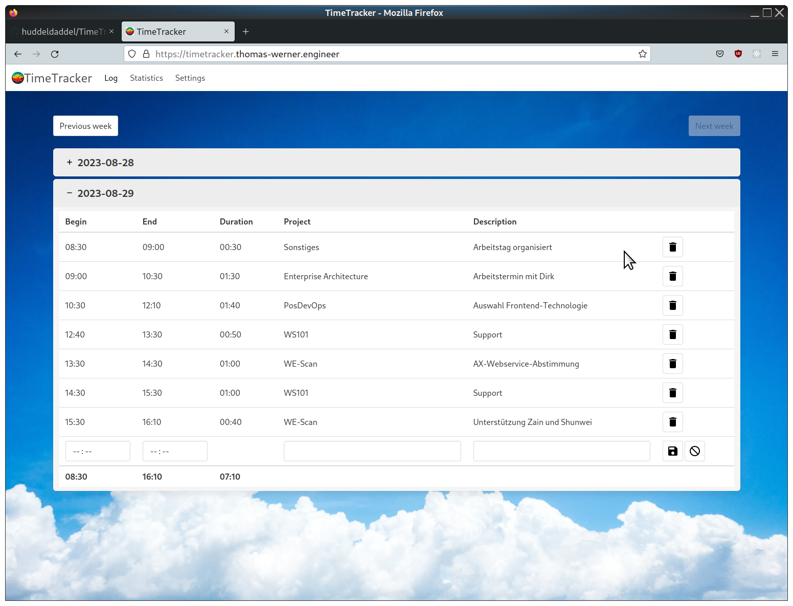
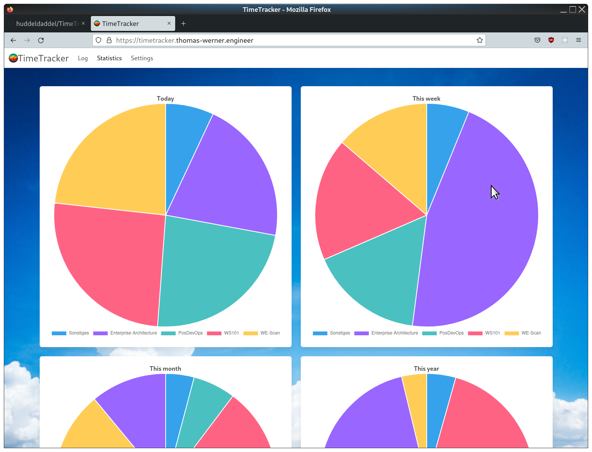
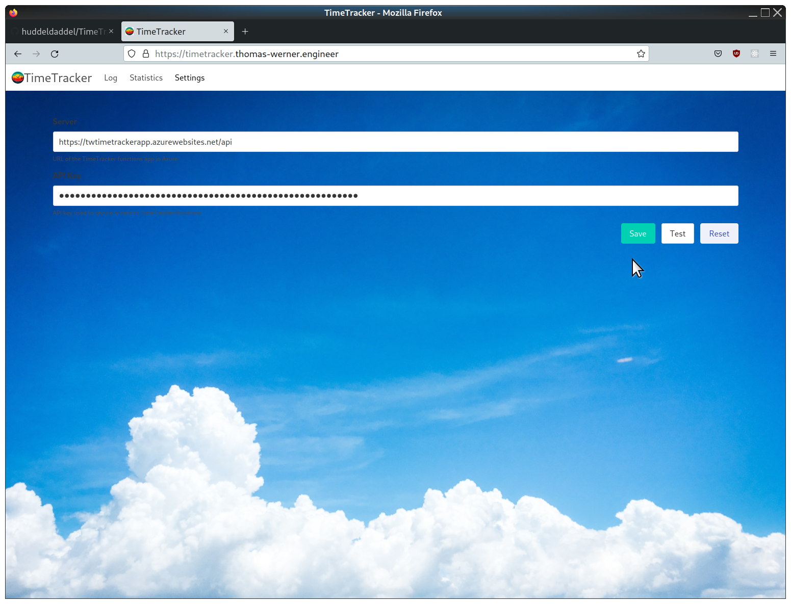

# TimeTrackerUI

This is the frontend for my personal time tracking application. It's based on the Aurelia framework. To use this app, you'll need to setup the [TimeTracker](https://github.com/huddeldaddel/TimeTracker) (backend) application, too. The backend is a serverless app meant to be hosted on Azure.

## How it looks

Logging time

Checking statistics

Configure settings

## Run dev app

Run `npm start`, then open `http://localhost:8080`
